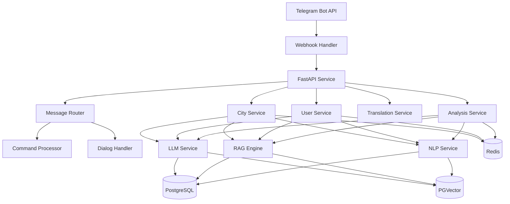
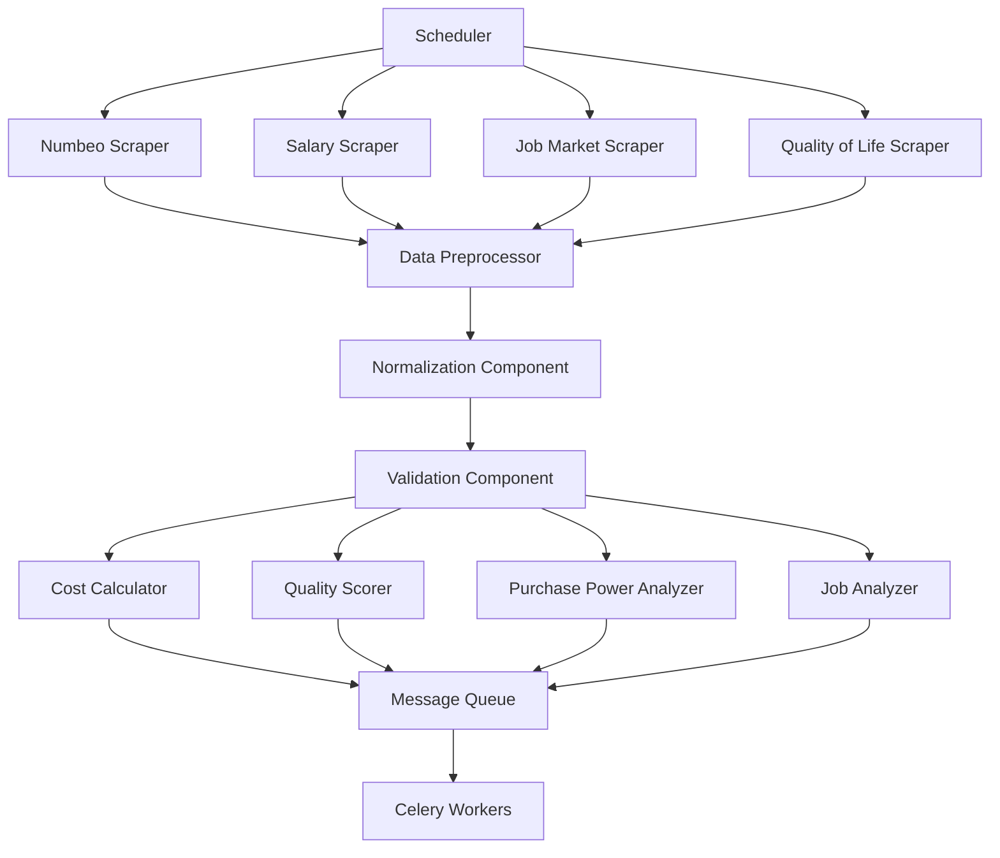
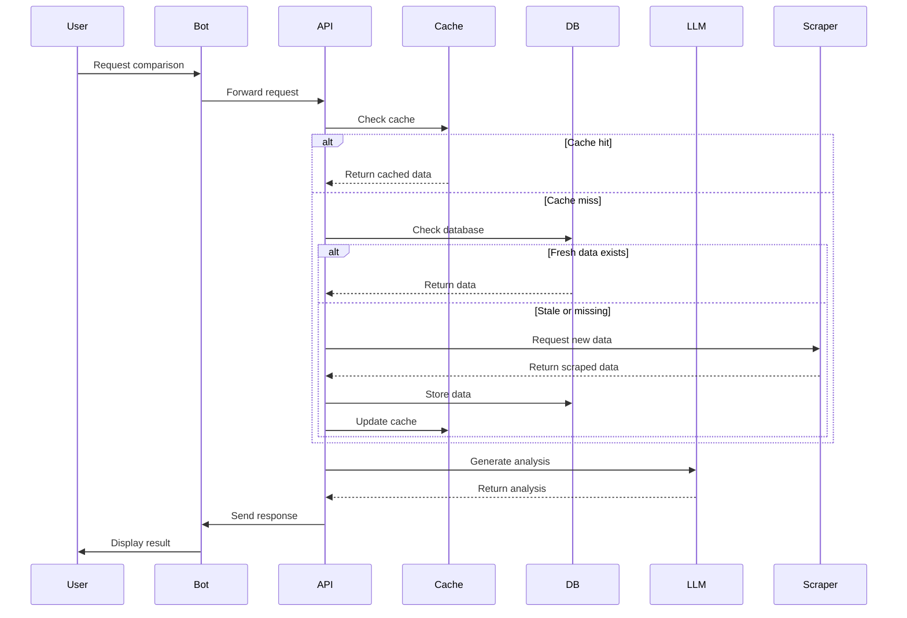
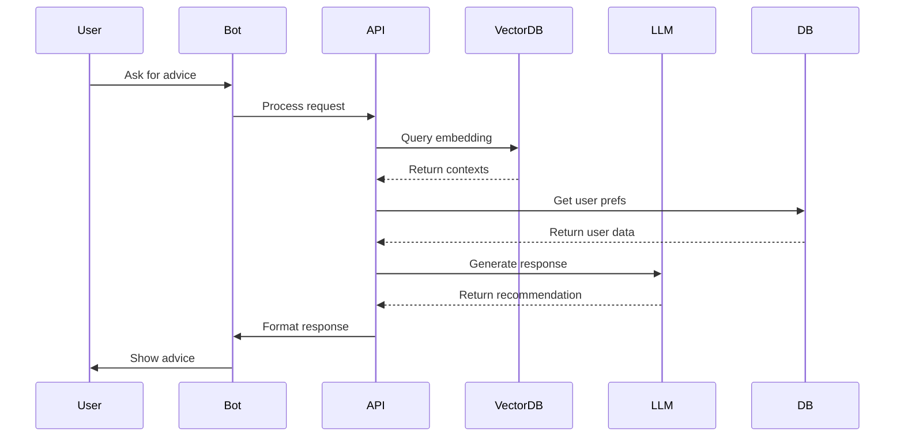

# Shakespr - AI-Powered Relocation Assistant
> To be, or not to be, that is the question.

## Overview
Shakespr is a Telegram bot designed to help people make informed decisions about international relocation. It provides real-world cost of living data, lifestyle comparisons, and personalized recommendations to help users evaluate potential destinations.

## Features
- Basic city information retrieval from Numbeo
- Cost of living comparisons
- Simple user profile management
- Data persistence in PostgreSQL


- City quality-of-life scoring
- Salary and purchasing power analysis
- Career opportunity evaluation
- Multi-language support
- Interactive data visualization
- AI-powered personalized recommendations

## Proposed System Architecture
The following diagrams represent potential future architecture designs that we're considering. These are preliminary proposals and may evolve based on feedback and project needs.

### Core System Components


### Data Collection and Processing


### Data Flow Examples
#### City Comparison   

#### RAG-based Recommendation


## Getting Started

### Prerequisites
- Python 3.8+
- PostgreSQL 12+
- Telegram Bot Token

### Local Development Setup

1. Clone the repository
```bash
git clone https://github.com/yourusername/shakespr.git
cd shakespr
```

2. Create virtual environment
```bash
python -m venv venv
source venv/bin/activate  # On Windows: venv\Scripts\activate
```

3. Install dependencies
```bash
pip install -r requirements.txt
```

4. Set up databases
```bash
# Create necessary databases
python scripts/setup_db.py

# Initialize schemas
psql -d user_data -f sql/user_data/schema/init.sql
psql -d numbeo_data -f sql/numbeo_data/schema/init.sql
```

5. Configure environment variables
```bash
# Copy example environment file
cp config/_env config/.env

# Edit .env with your settings
nano config/.env
```

6. Run the bot
```bash
python run_bot.py
```

## Contributing

We welcome contributions! Here's how you can help:

### Development Workflow
1. Fork the repository
2. Create a feature branch (`git checkout -b feature/amazing-feature`)
3. Make your changes
4. Run tests (once implemented)
5. Commit your changes (`git commit -m 'Add amazing feature'`)
6. Push to your branch (`git push origin feature/amazing-feature`)
7. Open a Pull Request

### Areas for Contribution
- Adding new data sources
- Implementing planned features
- Improving data visualization
- Adding tests
- Documentation improvements
- Bug fixes
- Performance optimizations

### Code Style
- Follow PEP 8 guidelines
- Include docstrings for new functions and classes
- Add type hints
- Write meaningful commit messages

## Technical Considerations

### Current Stack
- Python Telegram Bot API
- PostgreSQL for data storage
- Beautiful Soup for web scraping
- Python-dotenv for configuration

### Proposed Future Stack
- FastAPI for API layer
- Redis for caching
- LangChain for RAG implementation
- pgvector for vector storage
- Celery for task management
- Plotly/D3.js for data visualization


---

**Note**: This README reflects the current state of the project and potential future developments. The proposed architecture and features are preliminary and subject to change based on feedback and project requirements.
